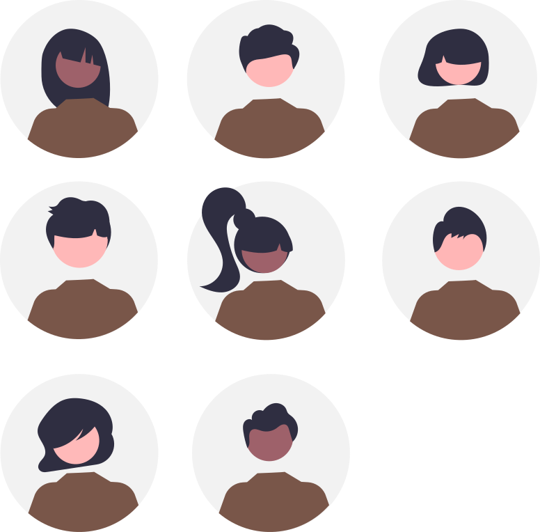

[{: align=left width=10%}](){target=_blank}[{: align=right width=10%}](mailto:@ecmorlaix.fr){target=_blank}Ce site s'adresse à des élèves de terminale du lycée Notre Dame du Mur de MORLAIX pour la vie de classe, l'orientation et les projets en SI et NSI...

{: .center width=50%}

[mail]: mailto:eric.madec@ecmorlaix.fr "eric.madec@ecmorlaix.fr"

***
<!-- ## Du 27/03

- [Grand Oral](https://eduscol.education.fr/729/presentation-du-grand-oral){target=_blank} ;
- [Dossier social étudiant](https://www.messervices.etudiant.gouv.fr/envole/){target=_blank} ;

***
## Le 02/03

- Poursuite du travail sur l'[orientation](./orientation) :
    - ==**Saisir** les derniers voeux sur [ParcourSup](https://www.parcoursup.fr/){target=_blank} avant le **09/03**== ;
    - **Rédiger** ses projets de formation motivés : un [guide ONISEP](./pdf/Fiche_projet-formation-motive.pdf){target=_blank} et des [exemples](https://thotismedia.com/exemple-projet-de-formation-motive/){target=_blank}
    {: .center width=70%}

- **Participer** aux [activités d'escape game pour l'accueil des troisièmes](https://ericecmorlaix.github.io/accueil_3/){target=_blank} ;
- **Faire** la [mise à jour d'Obsidian pour découvrir les canvas](https://ericecmorlaix.github.io/adn-Tutoriel_Obsidian/7-Options_Plugins/#canvas){target=_blank} ;

***
## Le 05/01 (1h)

- Poursuite du travail sur l'[orientation](./orientation) : 
    - **faire** des `note.md` dans [Obsidian](https://ericecmorlaix.github.io/adn-Tutoriel_Obsidian/){target=_blank}, une par formation, en y incluant des métadonnées (Nom, Lieu, Lien, Attendus, Processus, Dates, Coût, Débouchés, Opinion, Ordre, Questions... ) et des `#tag`, toutes regroupées dans un même dossier de votre coffre ;
    - **préparer** un [diaporama de présentation](https://ericecmorlaix.github.io/adn-Tutoriel_Obsidian/6a-Exports/#diaporama-basique){target=_blank} de votre projet d'orientation à plus ou moins long terme et des plans A, B, C, ..., que vous envisagez pour l'atteindre ;
    - **extraire** les informations utiles à l'aide de [requêtes partagées Dataview](https://md.picasoft.net/Ccpn8zieTQGD_4fGL8mV7Q){target=_blank} pour pouvoir répondre à des questions particulières ;    

***
## Le 16/12 (2h)

- Eléments d'analyse transactionnelle :

<iframe width="560" height="315" src="https://www.youtube-nocookie.com/embed/RxEhu8hWmXI" title="YouTube video player" frameborder="0" allow="accelerometer; autoplay; clipboard-write; encrypted-media; gyroscope; picture-in-picture" allowfullscreen></iframe>

{.center width=60%}

- Poursuite du travail sur l'[orientation](./orientation) : ==**faire** des `note.md` dans [Obsidian](./Obsidian), une par formation, en y incluant des métadonnées (Nom, Lieu, Lien, Attendus, Processus, Dates, Coût, Débouchés, Opinion, Ordre, Questions... ) et des `#tag`, toutes regroupées dans un même dossier de votre coffre pour faire des requêtes avec Dataview==

    - Du nouveau bientôt sur [Parcoursup 2023](./pdf/Parcoursup_2023-lettre_d'information_n%C2%B01-20221214.pdf) ;
    - Les sessions instat Fac à Brest se poursuivent tous les mercredis entre 14h et 16h : voir les [formations présentées](https://www.univ-brest.fr/cap-avenir/menu/Bloc-Lyceen/Insta_-Fac){target=_blank} ;
    - Les immersions en prépa à [Kérichen](./pdf/MINISTAGES_CPGE_KERICHEN-Lettre_aux_PROFESSEURS_PRINCIPAUX-min.pdf){target=_blank} et à [Lorient](https://www.lycee-lesage.fr/Formation/journees-dimmersion-en-cpge){target=_blank}

- Vers plus de [sobriété numérique](https://ec-morlaix.github.io/info/sobre/){target=_blank} : répondre au questionnaire du [Défi du grand ménage numérique](https://forms.office.com/Pages/ResponsePage.aspx?id=15R5OuUcb0Km4-7gYW4qbK8if53guTRDmm-NDtFB1m9UQUpKN1I5V0JVVDQyTTFLSjVKNDJITEFDTiQlQCN0PWcu){target=_blank}...

- Activités respectives dans chaque spécialités [TSI_2022-2023](https://ericecmorlaix.github.io/TSI_2022-2023/)
   ou [TNSI_2022-2023](https://ericecmorlaix.github.io/TNSI_2022-2023/) ;

***
## Le 08/12 (1h)

- Vie de Classe :

    - questions diverses...
    - Retours partiels de conseils de classes...

- Poursuite du travail sur l'[orientation](./orientation) : ==**faire** des `note.md` dans [Obsidian](./Obsidian), une par formation, des métadonnées (Nom, Lieu, Lien, Attendus, Processus, Dates, Coût, Débouchés, Opinion, Ordre, Questions... ) et des `#tag`, toutes regroupées dans un même dossier de votre coffre.==

    - Salon [SupArmor](https://www.suparmor.fr/){target=_blank} ce WE à St Brieuc ;
    - Ouverture du catalogue Parcoursup 2023 le 20/12 ;
    - Les sessions instat Fac à Brest se poursuivent tous les mercredis entre 14h et 16h : voir les [formations présentées](https://www.univ-brest.fr/cap-avenir/menu/Bloc-Lyceen/Insta_-Fac){target=_blank} ;

***
## Le 24/11 (1h)

- Vie de Classe :
    - **finir** de se préparer pour la certification [PIX](https://pix.fr/){target=_blank} programmée la semaine prochaine ;
    - questions diverses...

- Poursuite du travail sur l'[orientation](./orientation) : ==**faire** des `note.md` dans [Obsidian](./Obsidian), une par formation, avec des `#tag`, toutes regroupées dans un même dossier de votre coffre.==
    - nouvelle ressource : [https://ideo.bretagne.bzh/](https://ideo.bretagne.bzh/){target=_blank}

***
## Le 10/11 (1h)

- Vie de Classe :
    - Inscription au bac !
    - Apporter une copie de votre attestation JDC ou recensement URGENT ‼️ 
    - [PIX](https://pix.fr/){target=_blank} :
        - faire la [campagne de rentrée TGT code: `SFVUCW857`](https://app.pix.fr/campagnes/SFVUCW857){target=_blank} ;
        - puis faire la [campagne de récolte de votre profil PIX code `HCTRFS261`](https://app.pix.fr/campagnes/HCTRFS261){target=_blank}.
    - questions diverses...
- [Journée nationale de lutte contre le harcèlement scolaire](https://m.facebook.com/story.php?story_fbid=pfbid0GzTZtQfeZEL2ZFeFSgGqyeKhMEiHozACS7fEvpQayt3XRCY78gfnv8wEmMMNRtxil&id=100009852780025&sfnsn=scwspmo){target=_blank}

<iframe width="560" height="315" src="https://www.youtube-nocookie.com/embed/gFWq2W0Jly8" title="YouTube video player" frameborder="0" allow="accelerometer; autoplay; clipboard-write; encrypted-media; gyroscope; picture-in-picture" allowfullscreen></iframe>

- Poursuite du travail sur l'[orientation](./orientation) :
    

***
## Le 07/11
- Tutoriel de l'application multiplateforme [Obsidian](./Obsidian) ;
- Activités respectives dans chaque spécialités [TSI_2022-2023](https://ericecmorlaix.github.io/TSI_2022-2023/)
   ou [TNSI_2022-2023](https://ericecmorlaix.github.io/TNSI_2022-2023/) ;
   
***
## Le 17/10

- Bilan de la ["Fête de la science"](./fete_de_la_science) : :clap: :clap: :clap: ;

- Découverte de l'application multiplateforme [Obsidian](https://obsidian.md/){target=_blank} -> ==Synchroniser votre classeur déposé sur GitHup avec un coffre d'Obsidian localisé sur votre iPad et y apairer vos fichiers `note.ipynb` avec des `note.md` grace à jupytext dans Carnets== ;

??? resume "Memo de procédure de synchronisation avec GitHub sur iPad"

    Il y a une procédure spécifique pour Mobile (qui doit pouvoir s'appliquer également sur PC) :

    - créer un dépôt sur GitHub (privé ou public) avec un petit README.md (c'est plus pratique) ;
    - générer une clé d'identification sur GitHub <https://docs.github.com/en/authentication/keeping-your-account-and-data-secure/creating-a-personal-access-token>
    - créer un nouveau coffre dans Obsidian ;
    - installer et activer le plugin "Obsidian Git" <https://github.com/denolehov/obsidian-git> ;
    - renseigner les champs password/personal access token et username dans la configuration du plugin "Obsidian Git"
    - puis depuis la palette de commande choisir `Obsidian Git: Clone an existing remote repo` et suivre les instructions...

???+ tip "Comment se construire un second cerveau avec Obsidian en mode [Zettelkasten](https://fr.wikipedia.org/wiki/Zettelkasten)"

    
<iframe width="560" height="315" src="https://www.youtube-nocookie.com/embed/B9BLia6FN4s" title="YouTube video player" frameborder="0" allow="accelerometer; autoplay; clipboard-write; encrypted-media; gyroscope; picture-in-picture" allowfullscreen></iframe>

    
<iframe width="560" height="315" src="https://www.youtube-nocookie.com/embed/upyTEnzqJwk" title="YouTube video player" frameborder="0" allow="accelerometer; autoplay; clipboard-write; encrypted-media; gyroscope; picture-in-picture" allowfullscreen></iframe>

    
<iframe width="560" height="315" src="https://www.youtube-nocookie.com/embed/beCbmjygkAg" title="YouTube video player" frameborder="0" allow="accelerometer; autoplay; clipboard-write; encrypted-media; gyroscope; picture-in-picture" allowfullscreen></iframe>

- [Hommage à Samuel PATTY à 9h15](./pdf/documents_commentes_commemoration-2.pdf){target=_blank} ;

- Activités respectives dans chaque spécialités [TSI_2022-2023](https://ericecmorlaix.github.io/TSI_2022-2023/)
   ou [TNSI_2022-2023](https://ericecmorlaix.github.io/TNSI_2022-2023/) ;

***

***
## Vie de classe du 07/01

- [Orientation - Diaporama de présentation ParcourSup 2025](./pdf/PPT-_Parcoursup-2025.pdf){target=_blank}

***
## Séances SI-NSI du 02/12

=== "CONTENU DE SÉANCE"
    
    - Activités par spécialité [SI](https://ericecmorlaix.github.io/TSI_2025-2026/){target=_blank} ou [NSI](https://ericecmorlaix.github.io/TNSI_2025-2026/){target=_blank}.

=== "TRAVAIL À FAIRE"

    - **Finir** et **rendre** tous les travaux engagés...

***

## Vie de classe du 01/12

- Restitution du conseil de classe du premier trimestre ;
- [Orientation](./orientation) ;

  
***
## Séances SI-NSI des 06 et 13/11

=== "CONTENU DE SÉANCE"
    
    - **Réaliser** un bilan personnel sur [Capytale n° `d41d-7688068`](https://capytale2.ac-paris.fr/web/c/d41d-7688068){target=_blank} du projet ["Fête de la science"](./fete_de_la_science) et **énumérer** des suites possibles en projet support pour votre Grand Oral...
      
    - Activités par spécialité [SI](https://ericecmorlaix.github.io/TSI_2025-2026/){target=_blank} ou [NSI](https://ericecmorlaix.github.io/TNSI_2025-2026/){target=_blank}.

=== "TRAVAIL À FAIRE"

    - **Finir** et **rendre** tous les travaux engagés...

***

## Vie de classe du 03/11

- **Inscription au bac** et attestation de recensement ou de JDC ;
- [Orientation](./orientation) ;
- [PIX](https://pix.fr/){target=_blank}.

***
## Séance SI-NSI du 16/10

=== "CONTENU DE SÉANCE"
    
    - Evaluation écrite par spécialité ;

    - **Réaliser** un bilan personnel sur [Capytale n° `d41d-7688068`](https://capytale2.ac-paris.fr/web/c/d41d-7688068){target=_blank} du projet ["Fête de la science"](./fete_de_la_science) et **énumérer** des suites possibles en projet support pour votre Grand Oral...
      
    - Activités par spécialité [SI](https://ericecmorlaix.github.io/TSI_2025-2026/){target=_blank} ou [NSI](https://ericecmorlaix.github.io/TNSI_2025-2026/){target=_blank}.

=== "TRAVAIL À FAIRE"

    - **Finir** et **rendre** tous les travaux engagés...

***

## Séances SI-NSI des 16 et 18/09

=== "CONTENU DE SÉANCE"
    
    - **Découvrir** le fonctionnement des réseaux informatiques par la pratique :
        - Retour sur [Network-TP1](https://nbviewer.org/urls/ericecmorlaix.github.io/TSI-NSI_2025-2026/CR/Network-Un_BN_pour_la_communication_en_reseau-TP1.ipynb){target=_blank} [:fontawesome-solid-download:](https://ericecmorlaix.github.io/TSI-NSI_2025-2026/CR/Network-Un_BN_pour_la_communication_en_reseau-TP1.ipynb){ .md-button .md-button--primary } [Capytale e30a-6969721](https://capytale2.ac-paris.fr/web/c/e30a-6969721){target=_blank .md-button .md-button--primary } ;
        - Mise en oeuvre de [Network-TP2](https://nbviewer.org/urls/ericecmorlaix.github.io/TSI-NSI_2025-2026/CR/Network-Un_BN_pour_la_communication_en_reseau-TP2.ipynb){target=_blank} [:fontawesome-solid-download:](https://ericecmorlaix.github.io/TSI-NSI_2025-2026/CR/Network-Un_BN_pour_la_communication_en_reseau-TP2.ipynb){ .md-button .md-button--primary } [Capytale c91a-3900713](https://capytale2.ac-paris.fr/web/c/c91a-3900713){target=_blank .md-button .md-button--primary } ; 

    
    - Projets, objectif ["Fête de la science"](./fete_de_la_science) le 13 octobre... -> ==**Compléter** votre TODO liste, **prioriser** les tâches et **vérifier** leur faisabilité technique.==

=== "TRAVAIL À FAIRE"

    - Poursuivre tous les travaux engagés...

***
## Séances SI-NSI des 09 et 11/09

=== "CONTENU DE SÉANCE"

    - Projets, objectif ["Fête de la science"](./fete_de_la_science) le 13 octobre...
    
    ???+ abstract ""
        
        Suite à votre séance de brainstorming, organisés en équipages de projet autour de quatre domaines d'études correspondants à différentes formes d'**Intelligences Artificielles** :
        
            - l'intelligence mécanique (Elia, Killian, + Prof) ;
            - l'intelligence robotique (Augustin, Baptiste, Rémy) ;
            - l'intelligence domotique (Elouan, Luna, Yann) ;
            - l'intelligence générative (Oscar, Adam, Gabriel) ;
              
        > - **Créer** un dépot partagé pour [votre projet sur GitHub](https://ericecmorlaix.github.io/adn-Tutoriel_lab_si/IDE/GitHub/){target=_blank} ;
        > - **Faire** des recherches documentaires afin de **préciser** vos sujets respectifs ;
        > - **Initier** la production de votre médiation scientifique à destination de collégiens de quatrième en listant vos tâches dans une TODO liste en mode [agile](./fete_de_la_science/#demarche)...
        >
        > Et **Répondre** à la question transversale : *Peut-on affirmer que derrière toutes ces Intelligences Artificielles se cache en réalité toujours de l'intelligence humaine ?*

    - **Découvrir** le fonctionnement des réseaux informatiques par la pratique : [Network-TP1](https://nbviewer.org/urls/ericecmorlaix.github.io/TSI-NSI_2025-2026/CR/Network-Un_BN_pour_la_communication_en_reseau-TP1.ipynb){target=_blank} ;

    [:fontawesome-solid-download:](https://ericecmorlaix.github.io/TSI-NSI_2025-2026/CR/Network-Un_BN_pour_la_communication_en_reseau-TP1.ipynb){ .md-button .md-button--primary } [Capytale n° `e30a-6969721`](https://capytale2.ac-paris.fr/web/c/e30a-6969721){target=_blank .md-button .md-button--primary }

=== "TRAVAIL À FAIRE"

    - Poursuivre les travaux engagés...

***

## Vie de classe du 08/09

- **Rendre** une attestation de recensement ou de JDC ;
-  **Réaliser** une fiche de renseignements pour l'orientation au format `Markdown` dans [votre classeur numérique](https://ericecmorlaix.github.io/adn-Tutoriel_lab_si/IDE/GitHub/){target=_blank} et **partager** un lien vers ce document par [mail] ;
- [Orientation](./orientation) ;
- [PIX](https://pix.fr/){target=_blank}.

***

- **Découvrir** le fonctionnement des réseaux informatiques par la pratique : [Network-TP1](https://nbviewer.org/urls/ericecmorlaix.github.io/TSI-NSI_2025-2026/CR/Network-Un_BN_pour_la_communication_en_reseau-TP1.ipynb){target=_blank} ;

    [:fontawesome-solid-download:](https://ericecmorlaix.github.io/TSI-NSI_2025-2026/CR/Network-Un_BN_pour_la_communication_en_reseau-TP1.ipynb){ .md-button .md-button--primary } [Capytale n° `e30a-6969721`](https://capytale2.ac-paris.fr/web/c/e30a-6969721){target=_blank .md-button .md-button--primary }
-->
## Séances SI-NSI des 02 et 04/09

=== "CONTENU DE SÉANCE"

    - Présentation du fonctionnement...

    - Projets, objectif ["Fête de la science"](./fete_de_la_science) le 12 octobre :
        - rechercher des pistes de projets supports de médiations scientifiques en lien avec le thème retenu ;
        - réaliser un poster (type diagramme de contexte) présentant le système envisagé et listant ses fonctionnalités...    

=== "TRAVAIL À FAIRE"

    - Poursuivre les travaux engagés...
 

## Vie de classe du 02/09

- Accueil
    - [ ] Présentation du professeur principal-référent
    - [ ] Enjeux et exigences : Bac, ParcourSup, Pix...
- Rappels
    -	[ ] Self
       - Pas de vérification des régimes.
       - Explications : EXT, DP 2 à 4, DP5, INT, BOX. **Engagement pris pour toute l’année** modification à faire sur Ecole Directe avec les Codes Familles pour le 15/9 au plus tard.
       - Cartes de self identique + Autocollant de la classe.
       
      > Remarques :
      > - Possibilité de déjeuner au self sur inscription pour les externes (et DP2 ou 3 ou 4) avant 12h sur EcoleDirecte la veille.
      

    - [ ] Carnet de correspondance sur EcoleDirecte.
    - [ ] Règlement intérieur [pdf](https://www.ecmorlaix.fr/uploads/2018/09/Lycee-Reglement-interieur-et-Reglement-internat.pdf){target=_blank}/[vidéo](https://ecmorlaix-my.sharepoint.com/personal/delphine_nunez_ecmorlaix_fr/_layouts/15/stream.aspx?id=%2Fpersonal%2Fdelphine_nunez_ecmorlaix_fr%2FDocuments%2F00%20-%20SITE%20RESSOURCES%2FVIE%20SCOLAIRE%2FR%C3%A8glement_2026-2027.mp4&nav=eyJyZWZlcnJhbEluZm8iOnsicmVmZXJyYWxBcHAiOiJPbmVEcml2ZUZvckJ1c2luZXNzIiwicmVmZXJyYWxBcHBQbGF0Zm9ybSI6IldlYiIsInJlZmVycmFsTW9kZSI6InZpZXciLCJyZWZlcnJhbFZpZXciOiJNeUZpbGVzTGlua0NvcHkifX0&referrer=StreamWebApp.Web&referrerScenario=AddressBarCopied.view.fa038f3a-e98c-4aa8-a786-eb5c57f7639e){target=_blank} et [Charte Informatique](https://www.ecmorlaix.fr/uploads/2018/09/Charte-informatique-2026.pdf){target=_blank}      
    > Ces documents sont accessibles, comme d'autres, depuis la page [informations-pratiques du site du lycée](https://www.ecmorlaix.fr/nos-etablissements/lycee-notre-dame-du-mur/informations-pratiques/){target=_blank}

    - [ ] Présentation des ressources informatiques : ENT, Drive, Ecole Directe
    > Précision sur Ecole Directe ou panneau d’affichage pour les modifications d’EDT. Nécessité de consulter panneau d’affichage quotidiennement.  
    > Identifiant école directe : les élèves utilisent leur propre identifiant et pas le compte “famille”.  
    > Certificat de scolarité accessible sur Ecole Directe.

    - [ ] ASSR2 et DNB (passé normalement en 3e) ?

    - [ ] Attestation Recensement ou JDC

-	Options et emploi du temps
    - [ ] Vérification des options
    > En cas d’erreur, barrer en rouge et modifier sur document papier puis le déposer dans le casier du coordinateur de niveau pour vérification et validation.
    > Pas de changement accepté par rapport aux choix faits à l’inscription.
    - [ ] Distribution EDT individuels élèves

- [ ] Sur les heures de permanence, inscription préalable en Perm0 puis possibilité de :
    -	Travaux de groupes en Perm1 ;
    -	Travail individuel en silence en Perm0 ;
    -	Accès au CDI dans la limite des places disponibles.
    <!-- > Possibilité de dispense d’étude sur présentation d’un justificatif du responsable légal pour : code, conduite, immersions…  -->
- [ ] Autres documents si besoin...
- [ ] Autorisation de transport à rapporter
- [ ] Casiers
> Constituer des binômes.
> Attendre d’avoir un casier affecté par la vie scolaire (affichage rapide dans l’atrium).

- [ ] Noter les dates importantes dans l’agenda et commenter si nécessaire
    - Photos de classe le 10/09 ;
    - Réunion d’information aux parents :  le 17/09 en TGT à 18h ;
    - Messe de rentrée le 20/09 10h30 Eglise Sainte Mélanie, MORLAIX ;
    - Election des délégués : semaine du 5/10 (formation le 14/10 à la mairie de Morlaix);
    - Fin du 1er trimestre : le 27/11 ;  
    
    
- [ ] Fiche de renseignements pour l'orientation -> ==**A réaliser** au format `Markdown` dans [votre classeur numérique](https://ericecmorlaix.github.io/adn-Tutoriel_lab_si/IDE/GitHub/){target=_blank}  et **lien à partager** par [mail]==

- [ ] [PIX](https://pix.fr/){target=_blank}

